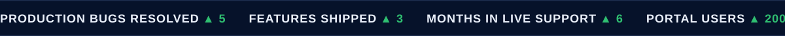

 

## About me

<table>
<tr>
<td width="72%" valign="middle">

I'm a **Software Engineering graduate from IIT, University of Dhaka**. I build and support software where reliability matters: **enterprise Java systems, fintech platforms and full-stack web apps**.

At **LEADS Corporation** I worked on a capital-market platform used by brokerages and portfolio managers, shipping features and fixing live production bugs. Outside work I build full-stack apps, distributed systems and small AI experiments.

> 🟢 **Open to work:** software engineering and support roles in Bangladesh and remote.

| 🎯 Focus | 🏦 Domain | 🌱 Exploring |
| :---: | :---: | :---: |
| Full-stack & backend | Enterprise & fintech | System design & DevOps |

</td>
<td width="28%" align="center">

</td>
</tr>
</table>

 

## Tech stack

 

<b>Enterprise:</b> Java · Oracle ADF · Oracle Database · WebLogic · MVC/Fusion · BI Publisher

 

## Experience

### Software Development Intern, LEADS Corporation Ltd. (CAPITA)
`Mar 2025 – Aug 2025` · Dhaka, Bangladesh

- Delivered **3 new features and enhancements** on an enterprise **Java / Oracle ADF** capital-market platform.
- Diagnosed and resolved **5 production bugs**, deploying fixes and keeping stakeholders updated.
- Worked on **KYC, trade management, settlement and portfolio accounting** modules, and on integrations with **CDBL, DSE and CSE**.
- Gave live production support: environment deployments, release assistance and post-deployment troubleshooting.
- Stack: **Oracle Database, WebLogic, ADF, MVC/Fusion, BI Publisher**.

 

## Featured projects

<table>
<tr>

<td width="33%" valign="top">

<h3>🎓 MIT Student Portal</h3>

Full-stack portal for 200+ users with three role-based dashboards, authentication, courses, enrollment, payments and results.

  

<code>Next.js</code> <code>Node.js</code> <code>Prisma</code> <code>MySQL</code> <code>JWT</code>

  

</td>

<td width="33%" valign="top">

<h3>🤖 Text2Code</h3>

Natural language to Python. Benchmarks three Seq2Seq models (RNN, LSTM, BiLSTM with attention) on CodeSearchNet.

  

<code>Python</code> <code>LSTM</code> <code>HuggingFace</code>

  

</td>

<td width="33%" valign="top">

<h3>⚖️ Rate Limiter</h3>

Containerized backend showing rate limiting, load balancing, object storage and database integration.

  

<code>Node.js</code> <code>Docker</code> <code>MySQL</code> <code>MinIO</code>

  

</td>

</tr>
</table>

Also built: <b>Mini Chess</b> · <b>Stack Overflow Clone</b> · <b>Hostel Management</b> · <b>Wumpus World</b> · <b>Tic Tac Toe</b>

 

## Achievements

| | Achievement | Details |
| :-: | :-- | :-- |
| 🥇 | **IIT Futsal Tournament** | Champion |
| 🥇 | **IIT Premier League Cricket** | Champion |
| 🥇 | **Short-Pitch Cricket Tournament** | Champion |
| 🎟️ | **IIT Tour** | Organized for 300+ attendees, coordinating with alumni |

 

## Education

**B.Sc. in Software Engineering**, Institute of Information Technology (IIT), University of Dhaka · CGPA `3.25 / 4.00`

 

## Let's connect

  

  

<i>Learn deeply. Build reliably. Ship with purpose.</i>

