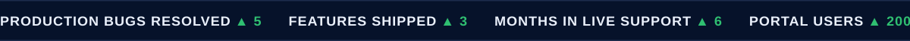

 

 

## 👋 About

<table>
<tr>
<td width="72%" valign="middle">

Software Engineering graduate from **IIT, University of Dhaka**, focused on **backend systems**: database design, transactions, concurrency and containerized deployment.

I've built a ride-pooling backend that prevents seat overbooking under concurrent requests, a university portal used by **200+ users**, and worked on a capital-market platform at **LEADS Corporation** using enterprise **Java and Oracle PL/SQL**.

🟢 **Open to work:** backend and software engineering roles in Bangladesh and remote.

| 🎯 Focus | 🧰 Core stack | 🌱 Exploring |
| :---: | :---: | :---: |
| Backend & concurrency | Java · Node.js · PostgreSQL · Docker | Distributed systems & DevOps |

</td>
<td width="28%" align="center">

</td>
</tr>
</table>

 

## 🛠️ Tech stack

 

<b>Enterprise:</b> Java · Oracle ADF · Oracle Database · PL/SQL · WebLogic · MVC/Fusion · BI Publisher

 

## 💼 Experience

**Software Development Intern** · LEADS Corporation Ltd. (CAPITA)
 
Mar 2025 – Aug 2025 · Dhaka, Bangladesh

- Delivered **3 features and enhancements** on an enterprise **Java / Oracle ADF** capital-market platform.
- Diagnosed and resolved **multiple production bugs** by reproducing issues and debugging Java and PL/SQL logic, then deploying fixes and keeping stakeholders updated.
- Worked across **KYC, trade management, settlement and portfolio accounting**, with integrations to **CDBL, DSE and CSE**.
- Supported live environments: deployments, release assistance and post-deployment troubleshooting.
- **Stack:** Oracle Database · WebLogic · ADF · MVC/Fusion · BI Publisher

 

## 🚀 Featured projects

<table>
<tr>

<td width="33%" valign="top">

<h3>🚗 Dhaka Tesla Pool</h3>

Ride-pooling platform where Tesla owners offer seats and passengers book and split the fare. Prevents seat overbooking under concurrent requests using transactions, row-level locking and database constraints. Tested with Vitest and Supertest, containerized with Docker Compose.

 

<code>Next.js</code> <code>Express</code> <code>PostgreSQL</code> <code>Docker</code> <code>Row-level locking</code> <code>Vitest</code>

  

</td>

<td width="33%" valign="top">

<h3>🎓 MIT Student Portal</h3>

Full-stack portal for 200+ users with three role-based dashboards, JWT authentication, password recovery, courses, enrollment, payments and results.

 

<code>Next.js</code> <code>Node.js</code> <code>Prisma</code> <code>MySQL</code> <code>JWT</code>

  

</td>

<td width="33%" valign="top">

<h3>🤖 Text2Code</h3>

Natural language to Python. Benchmarks three Seq2Seq models (RNN, LSTM, BiLSTM with attention) on CodeSearchNet.

 

<code>Python</code> <code>LSTM</code> <code>HuggingFace</code>

  

</td>

</tr>
</table>

Also built: <b>Stack Overflow Clone</b> (team, monolith to distributed) · <b>Rate Limiter &amp; Load Balancer</b> · <b>Wumpus World</b> (team) · <b>Mini Chess</b> (team) · <b>Hostel Management</b> (team) · <b>Tic Tac Toe</b>

 

## 🎓 Education

**B.Sc. in Software Engineering** · Institute of Information Technology (IIT), University of Dhaka
 
CGPA 3.25 / 4.00

 

## 🏆 Beyond code

🥇 Champion: IIT Futsal Tournament, IIT Premier League Cricket, Short-Pitch Cricket Tournament
 
🎟️ Organized the IIT Tour for 300+ attendees, coordinating with alumni

 

### 📬 Let's connect

  

<i>Learn deeply. Build reliably. Ship with purpose.</i>

